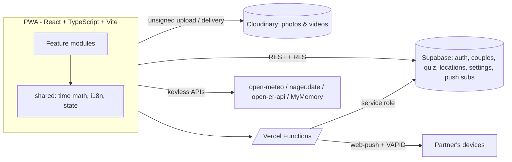

# Futari（ふたりの時間）— A dashboard for long-distance couples

**Live:** https://couple-dashboard-kappa.vercel.app

A production PWA for international long-distance couples, built around one idea:
**make a 13-hour time difference feel like one shared day.** Originally built for
a Tokyo⇄Santiago couple, now multi-tenant — any couple, any two cities.

> 🇯🇵 国際遠距離カップルのためのPWA。時差・言語・距離を「ふたりの一日」にまとめる
> ダッシュボードです。東京⇄サンティアゴの実利用から始まり、6日間でマルチテナントの
> 公開プロダクト（v1.0.0）まで育てました。**ランニングコストは0円**で運用しています。

## Features

| | |
|---|---|
| 🕐 **Dual sky clocks** | Both cities' local time on cards whose colors follow the actual sky (dawn/day/dusk/night), with live weather + sunrise/sunset |
| 💬 **"Can we talk now?"** | Computes the overlap of both partners' waking hours across time zones (DST-safe) and renders it as a 24h timeline |
| 📸 **Same Moment** | An hourly photo/video feed where Tokyo 20:00 and Santiago 07:00 land in the *same* slot — same instant, different clocks. Streak counter included |
| 🔮 **Daily psych test** | 30 classic projective tests (bilingual ja/es); the reveal and the partner's answer unlock only after you answer |
| 🌍 **Live map** | Canvas world map with a real-time day/night terminator, great-circle distance, and one-tap "I'm here" location sharing |
| 🖼 **Memories** | Shared photo/video stream that doubles as an ambient Ken Burns background slideshow |
| 🪄 **Translate & ideas** | In-site ja⇄es translation (browser Translator API → MyMemory fallback) + curated bilingual conversation starters |
| 📬 **Web Push** | "Your partner just posted" notifications with the app closed (VAPID, iOS PWA supported) |
| 💞 **Multi-tenant** | Magic-link accounts, invite-code pairing, per-couple data isolation via Postgres RLS |
| 🌐 **i18n** | Japanese / English / Spanish (es-CL), per-device |

## Architecture



- **Frontend**: Vite + React + TypeScript PWA. Feature-first structure (`src/features/*`),
  pure shared logic (`src/shared/*`). Installable; service worker with offline cache
  and push handlers.
- **Backend**: Supabase (Postgres + Auth). Every couple's data is isolated with
  **row-level security**; pairing runs through `security definer` RPCs so invite
  codes are never enumerable. Media files live on Cloudinary, metadata in Postgres.
- **Serverless**: Vercel Functions for Web Push fan-out and JWT-verified account
  deletion (secrets never reach the client).
- **Zero-cost external data**: weather/geocoding (open-meteo), public holidays
  (nager.date), exchange rates (open-er-api), translation fallback (MyMemory) —
  all keyless.

## Engineering highlights

- **Time-zone math as pure, tested functions** — the product's core (overlap
  windows, hour bucketing, day anchors, streaks) is DST-correct in both
  hemispheres and covered by unit tests (`npm test`, Vitest; incl. Chile's
  DST transitions in both seasons).
- **Multi-tenancy retrofit without downtime** — v0 was a single-couple app with
  data on public Cloudinary tags. v1.0 added auth, pairing, and RLS-isolated
  storage behind a `useCoupleScope()` seam: signed-out devices keep the legacy
  behavior, paired accounts get scoped storage, and a one-tap importer migrates
  legacy data. Shipped from a branch after full feature parity.
- **Progressive cost architecture** — every feature was first built at $0/month
  (e.g. quiz answers stored as base64url context metadata on 1×1 Cloudinary
  placeholder images), then promoted to Postgres when accounts arrived. The
  Claude-API translation feature was replaced by a browser-native + free-API
  pipeline when cost mattered more than polish.
- **Cross-language UX for a bilingual couple** — fixed-choice quiz answers are
  stored as indices and rendered in *each viewer's* language; free-text answers
  pass through untranslated by design. Push notification copy is bilingual.
- **Ops discipline** — trunk-based with feature branches for risky work, Vercel
  preview deploys, per-release CHANGELOG
  ([full history](CHANGELOG.md): v0.1.0 → v1.0.0 in 6 days).

## Project docs

- [CHANGELOG.md](CHANGELOG.md) — release-by-release history
- [PRD.md](PRD.md) — product vision and roadmap
- [supabase/schema-v2.sql](supabase/schema-v2.sql) — multi-tenant schema with RLS policies

## Development

```bash
npm install
npm test        # Vitest — time-zone math, streaks, quiz logic
npm run dev     # Vite dev server
npm run build   # tsc + production build (PWA)
```

Deploys automatically to Vercel on push to `main`.

### A note on keys in the source

The Supabase **anon** key and Cloudinary **unsigned preset** visible in the source
are public-by-design client credentials (they also ship in the site bundle).
Authorization is enforced server-side by Postgres RLS and Supabase Auth; all
private secrets (service role, VAPID private key) live only in Vercel env vars.

## License

Source-available for portfolio review. All rights reserved — please don't deploy
this as your own service.

---

*Built with [Claude Code](https://claude.com/claude-code) as a pair-programming
experiment: product decisions by the author, implementation driven through
conversational AI over ~6 days.*
